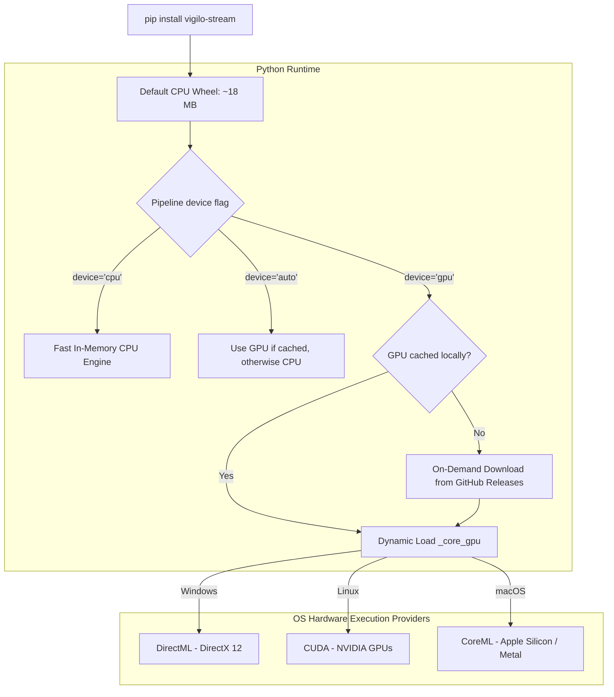

# Hardware & GPU acceleration

`vigilo-stream` provides a hybrid, high-efficiency architecture: a **lightweight CPU-optimized default install** combined with **on-demand GPU acceleration** across Windows, Linux, and macOS.

---

## Repository branches: CPU vs GPU builds

The `vigilo-stream` repository maintains separate dedicated branches:

| Branch | Target | Description |
| :--- | :--- | :--- |
| **`main`** *(default)* | **CPU Optimized** | Pure, lightweight CPU engine (~18 MB wheel). Default branch used for PyPI distribution and standard deployments. |
| **`gpu`** | **Hardware Accelerated** | Dedicated GPU branch containing DirectML, CUDA, and CoreML build pipelines for separate GPU releases. |

---

## CPU vs GPU architecture



---

## Why on-demand GPU download?

Bundling GPU runtime binaries (like `DirectML.dll`, NVIDIA CUDA libraries, or CoreML wrappers) directly inside the universal PyPI wheel bloats the package size from ~18 MB to over ~60 MB. Furthermore:
- A Windows DirectML binary is useless dead weight on Linux and macOS.
- Users on CPU-only laptops or cloud servers should not be forced to download large GPU runtimes.

With `vigilo-stream`'s on-demand architecture:
1. **`pip install vigilo-stream` is fast and small (~18 MB)**: installs in seconds anywhere.
2. **GPU binaries are downloaded only when requested**: just like default ONNX model weights (`download_models()`), the GPU backend is cached locally in `~/.cache/vigilo_stream/backends/` on first use.
3. **Zero configuration**: no manual driver compilation or complex environment variables needed.

---

## OS-specific execution providers

| Platform | Execution provider | Hardware support | Prerequisites |
| :--- | :--- | :--- | :--- |
| **Windows** | **DirectML** (DirectX 12) | NVIDIA, AMD Radeon, Intel Arc / Iris Xe, Qualcomm Adreno | Windows 10/11, DirectX 12 GPU |
| **Linux** | **CUDA** | NVIDIA discrete GPUs | NVIDIA driver, CUDA toolkit |
| **macOS** | **CoreML** (Metal / ANE) | Apple Silicon (M1/M2/M3/M4) | macOS 12+, Apple Silicon |

---

## Hardware recommendations: Integrated & Discrete GPUs

`vigilo-stream`'s DirectML and CoreML execution providers accelerate neural inference on **both dedicated GPUs (dGPUs) and integrated GPUs (iGPUs / APUs)**. However, inference performance depends heavily on the GPU architecture and memory bandwidth:

### Integrated GPUs (iGPUs & APUs)

Integrated graphics share system memory with the CPU. While DirectML runs on any DirectX 12-capable integrated chip, modern GPU architectures with dedicated tensor/dot-product instructions provide dramatically better performance:

| Vendor | Generation / Architecture | Example iGPUs | Status | Recommendation & Performance Notes |
| :--- | :--- | :--- | :--- | :--- |
| **Intel** | **11th Gen Core & Newer**<br>*(Tiger Lake, Alder Lake, Raptor Lake, Core Ultra / Meteor Lake, Lunar Lake)* | **Intel Iris Xe Graphics** (80–96 EUs),<br>**Intel Arc Graphics** (Xe-LPG / Xe2) | Verified & Supported | **Strongly Recommended**: Introduces high EU density (up to 96 EUs), LPDDR4x/LPDDR5 bandwidth, and hardware **DP4a instructions** for accelerated INT8/FP16 dot products, delivering smooth 30+ FPS real-time inference. |
| **Intel** | **10th Gen Core & Older**<br>*(Comet Lake, Coffee Lake, Skylake, etc.)* | Intel UHD Graphics 620/630,<br>Intel HD Graphics | Supported via DirectX 12 | **Use CPU Mode**: Older Gen 9/9.5 architectures contain only 24 EUs and lack DP4a acceleration. In benchmarks, the multi-threaded CPU engine often performs faster than or equal to older iGPUs. |
| **AMD** | **Ryzen 6000, 7000, 8000, & Ryzen AI 300 Series**<br>*(Zen 3+, Zen 4, Zen 5)* | **Radeon 660M / 680M** (RDNA 2),<br>**Radeon 740M / 760M / 780M** (RDNA 3),<br>**Radeon 880M / 890M** (RDNA 3.5) | Verified & Supported | **Strongly Recommended**: Features RDNA 2/3/3.5 architectures with hardware **WMMA (Wave Matrix Multiply Accumulate)**, dual-issue SIMD pipelines, and high-speed DDR5/LPDDR5 memory channels (up to 7500 MT/s) for high-efficiency inference. |
| **AMD** | **Ryzen 2000 – 5000 Series APUs**<br>*(Zen, Zen+, Zen 2, Zen 3 desktop/mobile)* | Radeon Vega 6, 7, 8, 10, 11 | Supported via DirectX 12 | **Supported, CPU may be faster**: Based on older GCN 5 (Vega) compute architecture and DDR4 memory bandwidth. While functional, the lightweight CPU engine may provide equivalent or superior throughput. |

::: tip Tips for Integrated GPU Users
- **Dual-Channel RAM**: Always run system memory in dual-channel configuration. Because integrated GPUs share RAM bandwidth with the CPU, single-channel memory can reduce GPU inference throughput by up to 40%.
- **Latest Drivers**: Keep OEM/vendor drivers updated. On Windows, install the latest [Intel Arc & Iris Xe Graphics Driver](https://www.intel.com/content/www/us/en/download/785597/intel-arc-iris-xe-graphics-windows.html) or [AMD Software: Adrenalin Edition](https://www.amd.com/en/support).
- **Power Profile**: On laptops, select the **Balanced** or **Best Performance** Windows power profile. Power saver modes can throttle iGPU clock frequencies below real-time inference thresholds.
:::

### Discrete GPUs (dGPUs)

Dedicated graphics cards offer dedicated high-speed VRAM (GDDR6/GDDR6X) and large compute arrays:

| Family | Supported Models | Recommended Execution Provider |
| :--- | :--- | :--- |
| **NVIDIA GeForce / RTX** | GTX 1060+, RTX 20-series, 30-series, 40-series, 50-series, RTX Ada / Quadro | **DirectML** on Windows, **CUDA** on Linux |
| **AMD Radeon RX** | Radeon RX 5000, 6000, 7000 series, Radeon PRO | **DirectML** on Windows |
| **Intel Arc** | Intel Arc A380, A580, A750, A770, Intel Arc B-series (Battlemage) | **DirectML** on Windows |

### Apple Silicon (macOS)

On macOS, all Apple Silicon chips (**M1, M2, M3, M4** across Base, Pro, Max, and Ultra tiers) feature unified memory and on-die Apple Neural Engine (ANE) accelerators. The **CoreML** execution provider automatically routes neural graph execution to the ANE and Metal GPU cores.

---

## Using GPU acceleration in Python

### 1. In the Pipeline constructor

Set `device="gpu"` or `device="auto"`:

```python
from vigilo_stream import Pipeline

# device="gpu": requires GPU acceleration (downloads backend on first call if missing)
pipeline = Pipeline(source_spec="camera:0", device="gpu")

# device="auto": uses GPU if already cached/available, otherwise seamlessly runs on CPU
pipeline = Pipeline(source_spec="camera:0", device="auto")

# device="cpu": always uses lightweight CPU execution (zero downloads)
pipeline = Pipeline(source_spec="camera:0", device="cpu")
```

### 2. Checking hardware support programmatically

```python
import vigilo_stream

# Check if current hardware supports GPU acceleration
supported, reason = vigilo_stream.detect_gpu_support()
print(f"GPU Supported: {supported} ({reason})")

# Query active execution provider
provider, is_gpu = vigilo_stream.device_info()
print(f"Active Provider: {provider}, GPU Enabled: {is_gpu}")
```

### 3. Explicitly enabling GPU backend

```python
import vigilo_stream

# Downloads GPU backend if missing, then activates it
success = vigilo_stream.enable_gpu(verbose=True)
if success:
    print("GPU acceleration active!")
else:
    print("Running on CPU.")
```

---

## Compiling from source with GPU features

If you are developing locally or building custom wheels, you can compile with Cargo feature flags directly:

```bash
# Windows DirectML build
maturin develop --features gpu-directml

# Linux CUDA build
maturin develop --features gpu-cuda

# macOS CoreML build
maturin develop --features gpu-coreml
```
