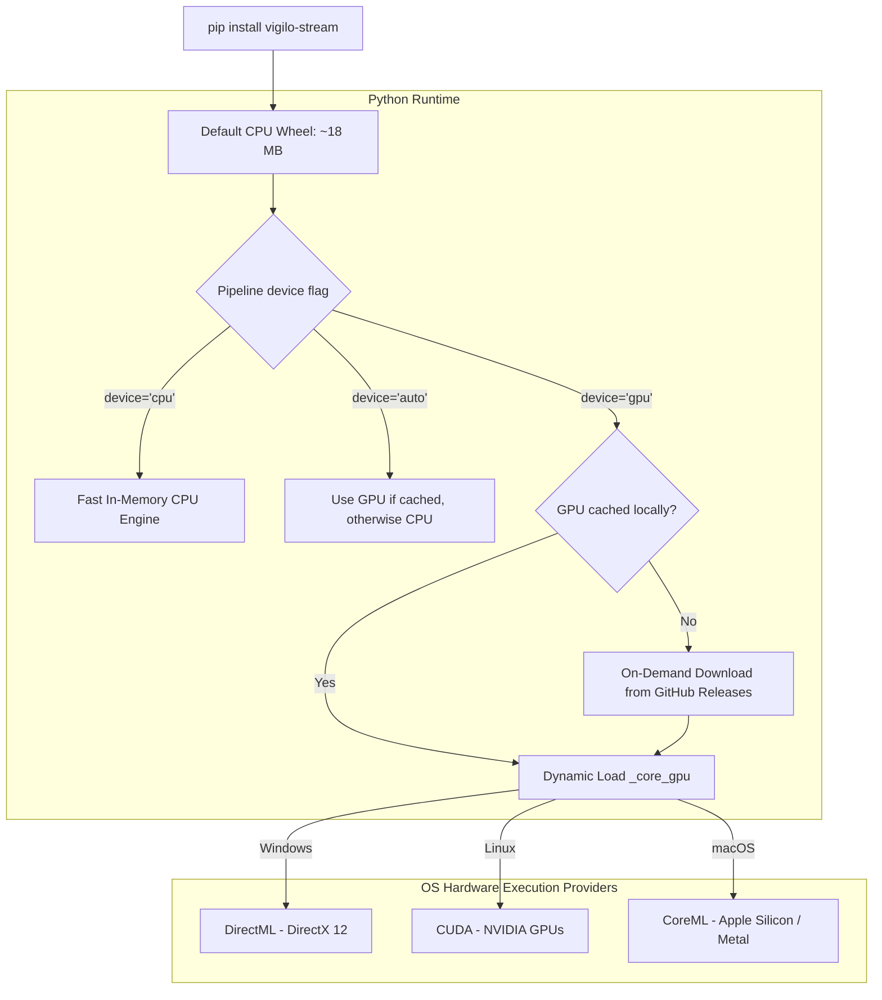

# Hardware & GPU acceleration

`vigilo-stream` provides a hybrid, high-efficiency architecture: a **lightweight CPU-optimized default install** combined with **on-demand GPU acceleration** across Windows, Linux, and macOS.

---

## Repository branches: CPU vs GPU builds

The `vigilo-stream` repository maintains separate dedicated branches:

| Branch | Target | Description |
| :--- | :--- | :--- |
| **`main`** *(default)* | **CPU Optimized** | Pure, lightweight CPU engine (~18 MB wheel). Default branch used for PyPI distribution and standard deployments. |
| **`gpu`** | **Hardware Accelerated** | Dedicated GPU branch containing DirectML, CUDA, and CoreML build pipelines for separate GPU releases. |

---

## CPU vs GPU architecture



---

## Why on-demand GPU download?

Bundling GPU runtime binaries (like `DirectML.dll`, NVIDIA CUDA libraries, or CoreML wrappers) directly inside the universal PyPI wheel bloats the package size from ~18 MB to over ~60 MB. Furthermore:
- A Windows DirectML binary is useless dead weight on Linux and macOS.
- Users on CPU-only laptops or cloud servers should not be forced to download large GPU runtimes.

With `vigilo-stream`'s on-demand architecture:
1. **`pip install vigilo-stream` is fast and small (~18 MB)**: installs in seconds anywhere.
2. **GPU binaries are downloaded only when requested**: just like default ONNX model weights (`download_models()`), the GPU backend is cached locally in `~/.cache/vigilo_stream/backends/` on first use.
3. **Zero configuration**: no manual driver compilation or complex environment variables needed.

---

## OS-specific execution providers

| Platform | Execution provider | Hardware support | Prerequisites |
| :--- | :--- | :--- | :--- |
| **Windows** | **DirectML** (DirectX 12) | NVIDIA, AMD Radeon, Intel Arc, Qualcomm Adreno | Windows 10/11, DirectX 12 GPU |
| **Linux** | **CUDA** | NVIDIA discrete GPUs | NVIDIA driver, CUDA toolkit |
| **macOS** | **CoreML** (Metal / ANE) | Apple Silicon (M1/M2/M3/M4) | macOS 12+, Apple Silicon |

---

## Using GPU acceleration in Python

### 1. In the Pipeline constructor

Set `device="gpu"` or `device="auto"`:

```python
from vigilo_stream import Pipeline

# device="gpu": requires GPU acceleration (downloads backend on first call if missing)
pipeline = Pipeline(source_spec="camera:0", device="gpu")

# device="auto": uses GPU if already cached/available, otherwise seamlessly runs on CPU
pipeline = Pipeline(source_spec="camera:0", device="auto")

# device="cpu": always uses lightweight CPU execution (zero downloads)
pipeline = Pipeline(source_spec="camera:0", device="cpu")
```

### 2. Checking hardware support programmatically

```python
import vigilo_stream

# Check if current hardware supports GPU acceleration
supported, reason = vigilo_stream.detect_gpu_support()
print(f"GPU Supported: {supported} ({reason})")

# Query active execution provider
provider, is_gpu = vigilo_stream.device_info()
print(f"Active Provider: {provider}, GPU Enabled: {is_gpu}")
```

### 3. Explicitly enabling GPU backend

```python
import vigilo_stream

# Downloads GPU backend if missing, then activates it
success = vigilo_stream.enable_gpu(verbose=True)
if success:
    print("GPU acceleration active!")
else:
    print("Running on CPU.")
```

---

## Compiling from source with GPU features

If you are developing locally or building custom wheels, you can compile with Cargo feature flags directly:

```bash
# Windows DirectML build
maturin develop --features gpu-directml

# Linux CUDA build
maturin develop --features gpu-cuda

# macOS CoreML build
maturin develop --features gpu-coreml
```
